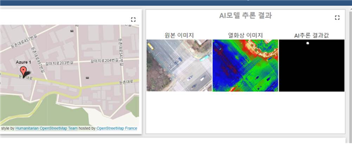

# SKKU_DXLAB_pipeline_abnomal_statements_detection_restapi

열수송관 상태 모니터링과 이상상태 데이터 수집 및 분석 모델 설계  
프로토타입 검진 시스템과의 통합

# Environment
flask  
tensorflow-gpu==1.15  
pytorch==1.6  
torchvision  
PIL  
